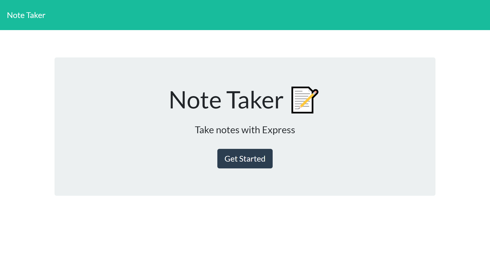
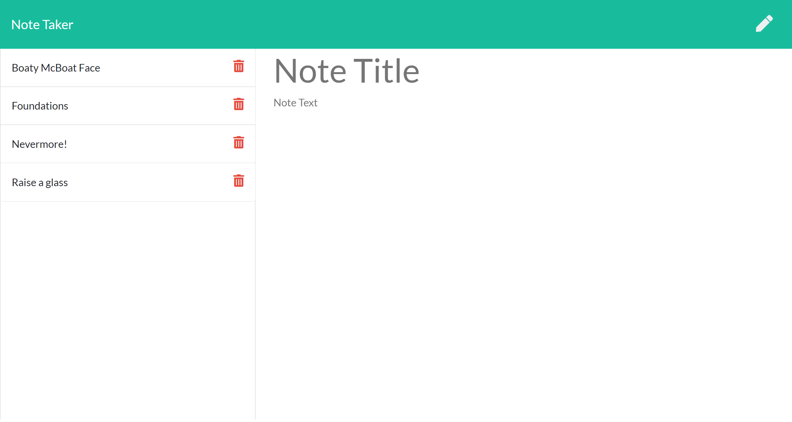
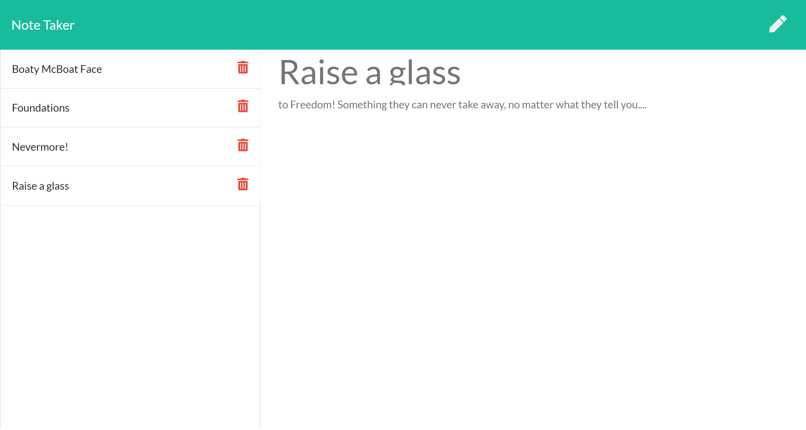
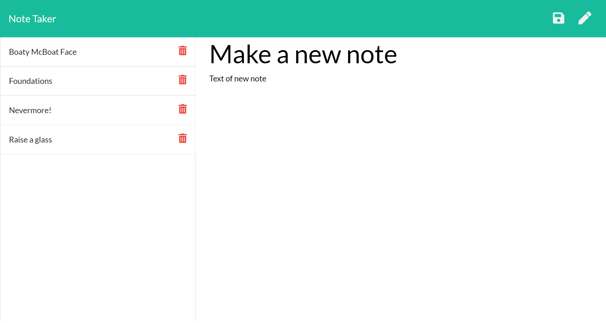

# Note Taker

## Table of Contents

* [Description](#description)
* [Links](#links)
* [Screenshots](#screenshots)
* [Installation Instructions](#installation-instructions)
* [Usage](#usage)
* [Technologies Used](#technologies-used)
* [Tests](#tests)
* [Credits](#credits)
* [Contributing](#contributing)
* [Questions](#questions)
* [Badges](#badges)

## Description

This application uses the Express library of Node.js to save, retrieve and delete notes entered by the user. The user begins by clicking the button on the landing page, which takes them to a page on which they can enter notes, save them, and view and/or delete previously-entered notes. To enter a note, the user should first click on the area of the "Note Title" and give their note a title, then click on the "Note Text" area to enter the text of their note. Once a title and text are entered, a "Save" icon appears in the upper right corner of the window, on which the user should click to save their note. Previously-entered notes appear on the left side of the screen, along with a trash can icon on which the user can click to delete the associated note. To view a previously-entered note without deleting it, the user should click on that note's title. If a previously-entered note is showing and the user wants to enter a new note, they should click on the pencil icon in the upper right corner.

## Links

[Deployed application on Heroku](https://glacial-inlet-91410.herokuapp.com/)

## Screenshots

Landing page:


Notes page with previously-entered notes on the left:


Notes page with previously-entered note selected:


Notes page with new note, showing "Save" icon in upper-right corner:


## Installation Instructions

If you want to run a copy of this app on your local machine, first clone the repository:

HTTPS:
```
$ git clone https://github.com/LauraCole1900/expressNoteTaker.git
```

SSH:
```
$ git clone git@github.com:LauraCole1900/expressNoteTaker.git
```

Then cd/ into the cloned directory and download the dependencies by typing into the command line
```
$ npm install --save
```

Once the dependencies are installed, start the application by typing into the command line
```
$ node server.js
```

Then go to the browser and enter into the address bar
```
$ localhost:3005
```

## Usage

This project is intended to be used for note-taking and -saving.

## Technologies Used

[](https://nodejs.org/en/) [](https://expressjs.com/)

## Tests

npm run test

## Credits

Base code and front-end functionality developed and provided by 2U/Trilogy Education Services

## Contributing

We believe code is never finished, welcome your contributions to enhance the applications functionality. Please adhere to the Code of Conduct for the Contributor Covenant, version 2.0, at https://www.contributor-covenant.org/version/2/0/code_of_conduct.html.

## Questions

If you have further questions, you can reach me at lauracole1900@comcast.net. For more of my work, see [my GitHub](https://github.com/LauraCole1900).

## Badges

[](./LICENSE) [](https://open.vscode.dev/LauraCole1900/expressNoteTaker)